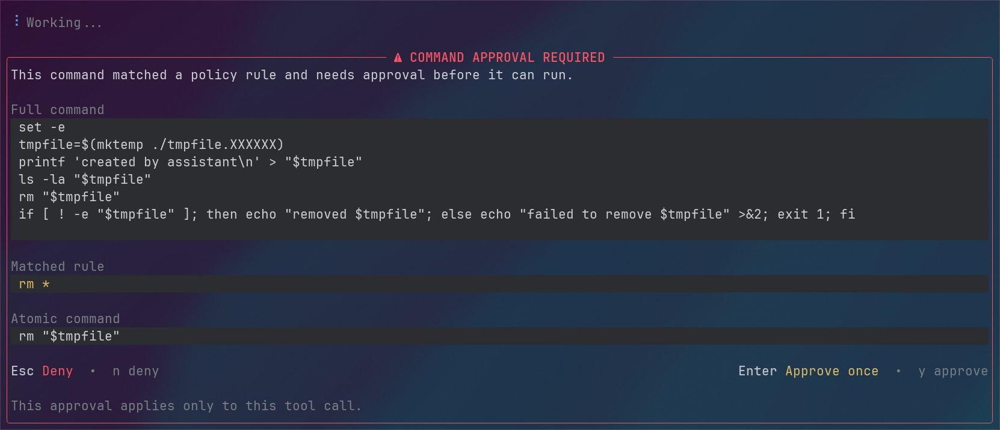
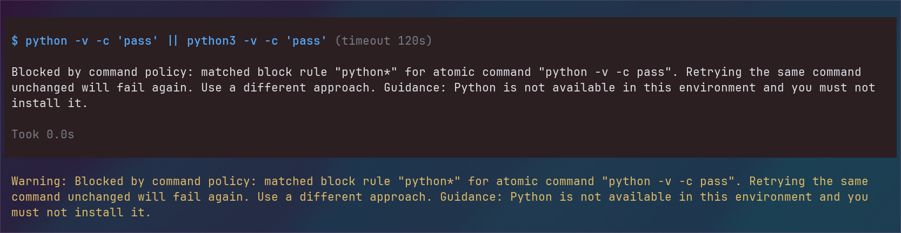

# Pi command policy extension

Global Pi extension that intercepts agent-initiated `bash` tool calls and classifies them as:

- allow
- confirm
- block

## Example

### Approval prompt

Example approval prompt for a rule that matches `rm *` for `confirm`:



Example `block` response with custom guidance note:



## Install location

- Extension folder: `~/.pi/agent/extensions/command-policy/`
- Startup entry shown by Pi: `command-policy.ts`
- Project policy: `.pi/command-policy.json5`
- Optional global policy: `~/.pi/agent/command-policy.json5`

## Reference files

Two reference files ship alongside this extension:

- [`example-global-policy.json5`](./example-global-policy.json5) — a comprehensive example global policy covering filesystem destruction, disk tools, force-push, global package installs, dangerous `chmod`/`chown`, Docker scorched-earth, curl-pipe-sh, credential exposure, remote push, and a broad `confirm` list. Copy to `~/.pi/agent/command-policy.json5` and trim to your needs.
- [`template-project-policy.json5`](./template-project-policy.json5) — a blank repo-level template with all three sections (`block`, `confirm`, `downgrade`) empty but fully commented. Copy to `.pi/command-policy.json5` in a repo and fill in only the rules that differ from your global policy.

If both policy files exist, they are merged:

- project-local `block` and `confirm` rules are applied alongside global rules
- project-local rules take precedence over global rules at the same severity
- project-local `downgrade` rules can lower the effective severity of matching global rules
- project-local direct `block` / `confirm` rules do **not** weaken matching global rules by themselves

## Reload

After editing the extension or a project-local policy file, run:

```text
/reload
```

The policy file is read on demand, so command changes should take effect immediately on the next intercepted bash tool call.

## Policy format

### Global policy

Use the global policy for your default machine-wide restrictions.

```json5
{
  version: 1,

  block: [
    "python*",
    {
      match: "pnpm add *",
      note: "Dependency additions should be reviewed before they run.",
    },
  ],

  confirm: [
    "pnpm remove *",
    {
      match: "kubectl delete *",
      note: "Double-check cluster, namespace, and target before continuing.",
    },
  ],
}
```

### Project policy

Use the project policy for project-local restrictions **and** for explicit downgrades of inherited global rules.

```json5
{
  version: 1,

  block: ["git push --force*"],

  confirm: [
    {
      match: "pnpm add *",
      note: "Dependency changes are expected in this repository, but still warrant approval.",
    },
  ],

  downgrade: {
    confirm: ["pnpm add *"],
    allow: ["python*", "pnpm remove *"],
  },
}
```

In the example above:

- a global `block` on `pnpm add *` is lowered to `confirm` in this project
- a global `block` on `python*` is lowered to `allow` in this project
- a global `confirm` on `pnpm remove *` is lowered to `allow` in this project
- the project can still add its own direct restrictions such as `git push --force*`

## Rule semantics

- string rules are exact matches after normalization unless they contain `*`
- `*` works like a wildcard inside the normalized atomic command string
- `block.note` should be remediation guidance
- `confirm.note` should be an approval hint
- `downgrade.confirm` lowers matching global `block` rules to `confirm`
- `downgrade.allow` lowers matching global `block` or `confirm` rules to `allow`

## Effective precedence

For a matching atomic command, the effective decision is determined in this order:

1. project `block`
2. global `block`, unless project `downgrade.confirm` or `downgrade.allow` matches
3. project `confirm`
4. global `block` downgraded by project `downgrade.confirm`
5. global `confirm`, unless project `downgrade.allow` matches
6. allow

This means:

- project rules can tighten behavior directly
- weakening inherited global behavior must be explicit via `downgrade`
- a project `confirm` rule does not silently override a matching global `block`

## Migration notes

- `version` remains `1`; the `downgrade` section is an additive extension to the existing schema
- existing global-only or project-only policy files continue to work unchanged
- if you previously relied on a project policy replacing the global policy entirely, review the merged result and add `downgrade` entries where the project needs to relax inherited global rules
