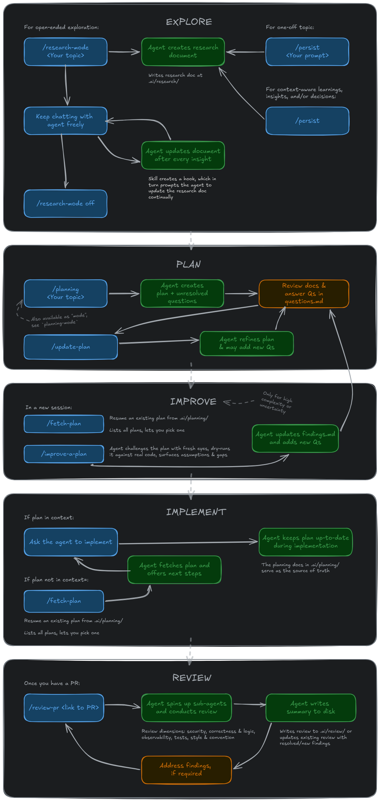

# My Personal Coding Agent Config Files

This repository contains a collection of configuration files for coding agents. Where a skill or agent hasn't been created by myself, an `Attribution.txt` in the same folder indicates the source and any modification I made to the original.

> [!NOTE]
> Once you have copied over the skills in this repository, you can always use `/update-skills` to fetch the latest skills from this repository, iterate through each new or changes one (ignoring local-only skills), showing you the change and asking you if you wish to update it.

## How to set up

### Quick setup

Run one of the commands below for your coding agent. The script will ask if you want to install skills, agents, and/or config files - and even if you choose config files, it'll check before overwriting an existing file. Skills and agents with the same names will be replaced though, if you choose to install skills or agents respectively. For Pi, the script also offers the starter extensions and themes from `.pi/agent/`, because the Pi starter config in this repository depends on them.

**Claude Code:**

```bash
curl -fsSL https://raw.githubusercontent.com/kimgoetzke/coding-agent-configs/main/setup.sh | bash -s -- --claude
```

**GitHub Copilot:**

```bash
curl -fsSL https://raw.githubusercontent.com/kimgoetzke/coding-agent-configs/main/setup.sh | bash -s -- --copilot
```

**Pi:**

```bash
curl -fsSL https://raw.githubusercontent.com/kimgoetzke/coding-agent-configs/main/setup.sh | bash -s -- --pi
```

For Claude Code and GitHub Copilot, this still will not install any hooks for you though. Pick and choose from the `/hooks` directory.

Each hook contains instructions. Pi does not support hooks, it uses the starter extensions under `.pi/agent/extensions/` instead, including the bundled `active-mode` extension that provides `*-mode` lifecycle reminders and stale-flag cleanup.

### Manual setup

If you prefer to set things up by hand:

- If you're just getting started, copy the files relevant for your agent from the root of this repository to your home folder
  - Example: `.copilot` -> `~/.copilot`
  - Example: `.pi` -> `~/.pi`
- Copy the entire `skills` folder from the root of this repository into your agent config folder
  - Example: `skills` -> `~/.copilot/skills`
  - Example: `skills` -> `~/.pi/agent/skills`
  - Agents pick up skills automatically on startup or when prompted to reload them
- If you're using Pi: the skills in this repo expect several extensions to be present, e.g. `subagent-support` and `active-mode`
- If you're using Claude Code or GitHub Copilot: Review the `hooks` folder from the root of this repository and pick any hooks you like
  - The files inside the `hooks` folder have comments explaining how to use them
  - The scripts from the `hooks` folder should be copied into `~/{agent}/hooks`
  - Pi does support the concept of hooks
- Start your coding agent and confirm the changes are being recognised
  - Every supported coding agent displays the name or number of skills loaded on start
  - Pi users can run `/reload` after copying files manually instead of restarting
  - Claude Code has a `/hooks` command to show loaded hooks

## How to use

### Skills

Each skill is somewhat opinionated, but there is no prescribed workflow - they were built to complement one another and can be composed however fits your process. One possible arrangement:



### Project folder structure

Skills that persist work to disk all write under a `.ai/` directory at your project root. A project that uses these skills will accumulate a structure like this:

```
your-project/
├── .ai/
│   ├── docs/
│   │   └── adr/                          # /grill-me, /improve-codebase
│   │       ├── 0001-my-decision-1.md
│   │       └── 0002-my-decision-2.md
│   ├── planning/                         # /planning, /planning-mode
│   │   └── 2026-04-01 my-task/
│   │       ├── 2026-04-02 my-topic.md    # /research-mode, /persist within plan context
│   │       ├── plan.md                   # - Work breakdown and decisions
│   │       ├── findings.md               # - Research and discoveries
│   │       ├── questions.md              # - Questions and responses
│   │       └── progress.md               # - Session log (multi-phase plans only)
│   ├── research/                         # /research-mode, /persist
│   │   └── 2026-04-01 my-topic.md
│   ├── review/                           # /review-pr
│   │   └── 2026-04-01 42 my-pr-title.md
│   └── .active-mode                      # Temporary flag file (auto-cleared on session start)
└── context.md                            # /grill-me, /improve-codebase
```

### Pi extensions

If you use Pi, the starter extensions included in this repo are:

| Extension                 | Purpose                                                                                              |
| ------------------------- | ---------------------------------------------------------------------------------------------------- |
| `active-mode`             | Lifecycle reminders and stale flag cleanup for `*-mode` skills                                       |
| `command-policy`          | Configurable allow/deny list for shell commands the agent may run                                    |
| `conversation-statusline` | Shows session info in the Pi status line                                                             |
| `footer-statusline`       | Adds a footer status line to the Pi UI                                                               |
| `message-timestamps`      | Annotates messages with timestamps                                                                   |
| `subagent-support`        | Delegates work to isolated Pi subprocesses, each with its own context window                         |
| `usage-statistics`        | Tracks and displays token usage across sessions                                                      |
| `web-search`              | `web_search` and `fetch_content` tools — structured, token-efficient web access, no API key required |

## Attribution

See `Attribution.txt` in skill folders or at the root of the agent folder.

- Matt Pocock: https://github.com/mattpocock/skills
- Ahmad Othman Ammar Adi: https://github.com/OthmanAdi/planning-with-files
- HumanLayer: https://github.com/humanlayer/humanlayer
