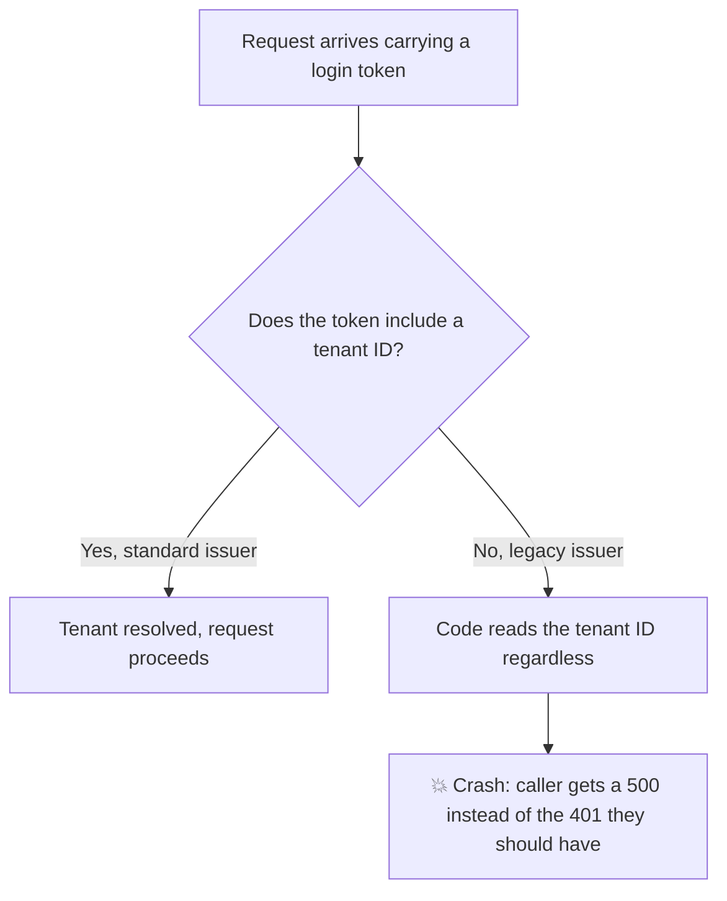

# Review PR

**Three rules that override everything else in this skill:**

- **Never auto-post to GitHub.** Even non-interactively or in an "auto" mode, you MUST NOT post review comments without explicit sign-off from the user (step 10). The one exception: the user asked for posting when invoking the skill (e.g. "review PR 42 and post the comments").
- **Verify before you report.** Sub-agent findings are unverified candidates. Every one passes through triage (step 6) before it reaches the review. This is how we keep out the noise.
- **Never modify the PR branch or push code.** This skill reads and reports.

## Severity scale

Used for individual findings and for dimension scores:

- 🔴 **Red (Blocker)**: fatal — the PR must not merge until it is fixed. Data loss or corruption, a security hole, a crash or broken core path, an unintended breaking change.
- 🟠 **Amber (Important)**: significant but not fatal — a real bug on a non-critical path, a meaningful gap in error handling, a missing test for important behaviour.
- 🟡 **Yellow (Minor)**: real but minor — naming, small readability improvements, minor observability gaps. Does not block merge.
- 🟢 **Green**: no issues. A **dimension score only** — no individual finding is ever green, because anything that trivial is discarded in triage.

## Writing for a reader outside this repository

This governs every word you write in the review document and in the GitHub comments — findings, summaries, rationales, diagram labels alike.

Once you have read the code you can no longer tell which parts of your explanation only work for someone who has also read it. Assume the reader has not. The goal is that they can decide **whether they need to open the codebase at all** to agree or disagree with you — not that they must open it before your sentence parses.

- **Say what the code is for before saying what is wrong with it.** A reader who does not know the purpose cannot tell which details matter. "Renaming a tenant used to 404 until the next restart" before "the loader keeps a second map keyed by the old alias".
- **Name things by what they do in the world, then by symbol.** "the filter that rejects unauthenticated requests (`AuthFilter.java:52`)", not "the filter". This is the same rule step 7 applies to diagram nodes.
- **Give every symbol a location on first mention.** Class, method, file, flag, table, environment variable: `path:line`, once, the first time it appears.
- **Never coin a term.** Use the name the codebase already uses — grep for it rather than inventing one. No "ownership boundary", "the resolution layer", "the new flow" unless the repository says so.
- **Make every claim checkable.** A line, an error string, a command, a number. An assertion the reader cannot verify is one they have to take on trust, which is exactly what this skill exists to avoid.
- **Do not teach the language or the framework.** Context is a clause, not a preamble. No paragraph explaining dependency injection at the top of a Spring finding.

## Step 1: Check prerequisites

Run `gh --version`. If `gh` is not found, tell the user it is required to fetch the PR or post anything back, and ask whether to continue regardless.

- If they decline, stop.
- If they accept: skip steps 2 to 4, diff the current branch against its base with `git diff` in step 5, record `no PR metadata — gh unavailable` in the frontmatter fields you cannot fill, and skip posting in step 10.

## Step 2: Resolve the PR

**Argument provided:**

- A GitHub PR URL — compare its `owner/repo` against `gh repo view --json nameWithOwner --jq '.nameWithOwner'`. If they differ, reply "This skill only supports reviewing PRs in the current repository. Please switch to the relevant repo and try again." and stop.
- A bare number, or a URL for this repository — extract the number and proceed.
- Anything else — say the argument was not recognised and ask for a PR number.

**No argument:** run `gh pr view --json number,title,url 2>/dev/null` to detect a PR for the current branch. If none, ask the user for a number.

## Step 3: Gather PR metadata

```bash
gh pr view {number} --json number,title,headRefName,baseRefName,url,body,author,state,commits
```

This confirms the PR exists. Also collect:

- Latest commit on the PR branch: `gh pr view {number} --json commits --jq '.commits[-1].oid'`
- Date and time: `date '+%Y-%m-%d %H:%M:%S %Z'`
- Repository slug: `gh repo view --json nameWithOwner --jq '.nameWithOwner'` — the `{owner/repo}` used in the frontmatter and in step 10's API path

## Step 4: Check for existing review

Search `{repo root}/.ai/review/* {pr-number} *.md` — the number is a whole space-delimited field, so a bare `*{pr-number}*` glob would also match dates. On multiple matches, take the one whose `pr_number` frontmatter matches.

**If a review exists**, compare its `last_reviewed_commit` against the latest commit from step 3:

- **Equal** — tell the user the PR is already reviewed up to the latest commit, and ask whether to review again anyway. If not, stop.
- **Different** — this is a re-review: scope the diff in step 5 to the new commits, and update the existing file rather than creating one.

## Step 5: Analyse the diff

**Fetch the diff:**

- New review: `gh pr diff {number}`
- Re-review: `git fetch origin {headRefName}`, then `git diff {last_reviewed_commit}..{latest commit}`. If a commit is missing locally, fall back to `gh pr diff {number}` and note in the review that it was not scoped to the new changes

**Read project conventions:**

- Agent-instruction files, where present: `CLAUDE.md`, `AGENT.md`, `.claude/CLAUDE.md`, `.copilot/copilot-instructions.md`, `.pi/agent/AGENT.md`
- Convention skills matching the file types in the diff (e.g. `rust-test-conventions`, `rust-standards`) — read their SKILL.md
- Keep a list of every skill consulted, `review-pr` included; it goes in the output document and your final response

**Spawn the review sub-agents in parallel**, one per dimension: `correctness-reviewer`, `security-reviewer`, `test-reviewer`, `conventions-reviewer`, `observability-reviewer`.

Every sub-agent prompt must include:

- The diff, plus the convention references gathered above — test conventions to `test-reviewer`, project and language conventions to `conventions-reviewer`, telemetry conventions to `observability-reviewer` (which already has basic OTel conventions embedded)
- A reminder to return findings with file paths, line numbers and a severity
- A reminder to recommend a dimension score of 🟠 amber, 🟡 yellow or 🟢 green only, with a rationale — 🔴 red is yours to assign, not theirs
- **The evidence rules below, quoted verbatim** — they are the main defence against speculative findings, so do not paraphrase them away

**Evidence rules for sub-agents:**

> Every finding you return MUST carry these four fields on top of the usual ones:
>
> - **Context:** what the code you are reporting on is *for*, in one or two sentences a reader outside this repository would understand. Name the caller that reaches it and the user-facing operation it serves. Write "`resolve()` turns the tenant claim on an incoming login token into the tenant the request runs as; every authenticated API call passes through it", not "the tenant resolution method". You have the file open already, so this costs you nothing and is the difference between a review someone can act on and one they have to re-derive.
> - **Evidence:** the specific code you read that supports the claim, cited as `path:line` — including code outside the diff (callers, callees, config, existing tests). A diff hunk on its own is not evidence that a problem is real; it is only where you started looking.
> - **Trigger:** the concrete input, state, or sequence that makes the problem actually happen, and the wrong outcome it produces. For example "a request with a null `tenantId` reaches `resolve()` and throws an NPE at line 88", not "this could fail if the input is unexpected".
> - **Holds if:** each assumption you could not verify yourself, one bullet apiece, phrased so someone else can check it. Write "nothing — verified in this repo" when there are none.
>
> If you cannot write a specific **Trigger**, you do not have a finding — drop it. Do not report it with a caveat, a hedge, or a low confidence rating. "Might", "could potentially" and "in some cases" with no named case are all signs you are speculating.
>
> Never assume behaviour you have not read. If a claim depends on how a caller, a framework, a library, or a config behaves, go and read it. If you cannot read it (external service, runtime-only behaviour, another repository), that belongs in **Holds if:** — it does not silently become a fact.

## Step 6: Verify and triage findings

The sub-agents are deliberately sensitive and over-report. You verify every candidate before it reaches the review document — a review full of wrong or silly suggestions is worse than a short, sharp one.

For each candidate finding:

1. **Confirm it is true.** Read the referenced lines and their surrounding context. Common failure modes: the finding misreads the code, the "missing" handling exists elsewhere, a test or a type already covers it, or the suggestion contradicts a project convention.
2. **Check the `Evidence:` citations.** Open each `path:line` and confirm it says what the finding claims. A citation that does not resolve, or does not support the claim, discredits the finding — discard it.
3. **Check the `Trigger:`.** No trigger, or one too vague to reproduce, means speculation — discard it, and do not rewrite it into a real finding on the sub-agent's behalf. A hedged finding is the most expensive kind of noise: it still costs the author a full investigation.
4. **Settle each `Holds if:` bullet** against the repository:
   - Verified → strike it off.
   - Disproved → discard the finding, its premise is wrong.
   - Unverifiable from the code (production data, an external service, another repository, the author's intent) → it stays, and the finding is **conditional**.
5. **Decide its fate:**
   - **Discard** anything false, speculative, already handled, or a nit that does not genuinely matter. Be ruthless.
   - **Discard** a conditional finding whose assumption is far-fetched, whose worst case is minor even if it holds, or which still carries more than two assumptions. Conditional is not a licence to keep a weak finding — the bar is "the author would want to be asked".
   - **Rephrase** anything real but vaguely, overstatedly or wrongly worded. State it plainly, as a question or a suggestion rather than a demand.
   - **Keep** the rest as-is.
6. **Assign a tier.** Sub-agents recommend amber, yellow or green and over-use amber; you make the real call, including whether something is a red blocker.

**Confirmed vs conditional** governs how a finding is written, scored and posted:

|                  | **Confirmed**                      | **Conditional**                                            |
| ---------------- | ---------------------------------- | ---------------------------------------------------------- |
| Marker           | none                               | `⚠️ Conditional`                                            |
| Phrasing         | stated as fact, trigger folded in  | a question to the author, never an assertion it is broken   |
| Assumptions      | none                               | the one or two surviving `Holds if:` bullets, listed under it |
| Maximum tier     | 🔴 red                             | 🟡 yellow — no unverified assumption may block a merge      |
| Suggestion block | allowed                            | never                                                       |

If a conditional finding would be a blocker were its assumption true, settle the assumption (ask the user, read more code) rather than raising the tier on a guess. If it cannot be settled, leave it conditional at yellow and say in the finding that it would be a blocker if the assumption holds.

You may spawn sub-agents to help. Give each the findings and the diff with one instruction: attempt to **disprove** each finding against the code, and report either the concrete reason it is wrong or that none was found. "Could not disprove" is input to your decision, not the decision.

## Step 7: Visualise each finding

Where prose alone leaves the path through the code hard to follow, give the finding a **Mermaid diagram** that explains the problem to someone seeing the code for the first time, placed directly under the finding in the review document. Mermaid renders natively on GitHub and in most Markdown viewers, so this needs no extra file.

**Skip the diagram** where the finding is obvious at a glance from a single line or a small function — a wrong operator, an inverted condition, a naming nit, a missing null check on the line above. A diagram that only restates the code is noise. Most style and convention findings need none; most correctness, security and concurrency findings earn one.

**Match the form to the problem:**

| The finding is about                       | Use                                                        |
| ------------------------------------------ | ---------------------------------------------------------- |
| A wrong or missing path through the logic   | `flowchart`                                                 |
| Ordering, timing, a race, a call sequence   | `sequenceDiagram`                                           |
| A lifecycle or state transition             | `stateDiagram-v2`                                           |
| Missing test coverage                       | a short table of cases covered vs not — a diagram adds nothing |

**Rules for the diagram:**

- Label nodes with what happens in the world, not with symbols — "a token arrives with no tenant ID", not "`resolve()` line 88". A reader who has never opened this repo must still follow it
- Show only the broken path and the working path it diverges from. A diagram of the whole feature buries the point
- Mark where it goes wrong and what the reader should conclude — a `💥` node, or a `Note over` in a sequence diagram
- Keep it to about ten nodes. Needing more means the finding covers too much and should be split
- For a conditional finding, put the diagram after the `Holds if:` bullets, and draw the path as the one that occurs *if* the assumption holds

The confirmed example from step 9 would carry:



## Step 8: Score each review dimension

Give each dimension — correctness & logic, security, tests, style & conventions, observability — the highest tier among its surviving findings, plus a one-line rationale.

Do not inflate: reserve red for true blockers, and do not push a genuine minor nit up to amber because it is the only finding. Conditional findings cap at yellow, so a dimension whose findings are all conditional cannot score amber or red.

## Step 9: Write the review to disk

Save to `{repo root}/.ai/review/{yyyy-mm-dd} {pr-number} {pr-title-abbreviated}.md`, creating `.ai/review/` if needed. The title is kebab-case, truncated at a word boundary to 50 characters. For a re-review, update the existing file.

**Finding format.** Every finding opens with the same header line:

```text
{severity emoji} **[{status}]** {⚠️ Conditional, if it is} — `path:line` — {headline}
```

Any severity pairs with any status (`[New]`, `[Unresolved]`, `[Resolved]`) — a resolved finding keeps the severity it was first given, and on an initial review everything is `[New]`. The `path:line` is mandatory: it anchors the inline comment in step 10. The headline says what goes wrong in the reader's terms, not in the code's: "Tokens from the legacy issuer crash instead of returning 401", not "missing null check in `resolve()`".

What follows the header depends on the tier. **Red and amber take the full shape; yellow stays a single sentence.** A minor finding does not earn four headings, and a blocker is not something the author should have to reconstruct from one.

**Red and amber — full shape.** Four labelled parts, in this order, each one to three sentences:

````text
🟠 **[New]** — `TenantResolver.java:88` — Tokens from the legacy issuer crash instead of returning 401

**What this code does.** `resolve()` turns the tenant claim on a login token into the tenant a request runs as. Every authenticated API call reaches it through `AuthFilter` (`AuthFilter.java:52`).

```java
// TenantResolver.java:86-89
var tenantId = claims.get("tenant_id");
return tenantRepository.findBySlug(tenantId.toString());  // line 88 — no null check
```

**What goes wrong.** `LegacyTokenFactory` (`LegacyTokenFactory.java:34`) mints tokens without a `tenant_id` claim. Those reach line 88, `tenantId` is null, and the NPE escapes before the 401 is written, so the caller sees a 500 and the real reason for the rejection is lost.

**How I checked.** `LegacyTokenFactory.java:34` omits the claim. Neither caller of `resolve()` null-checks first (`AuthFilter.java:52`, `TokenRefreshController.java:30`). No test covers a token without the claim (`TenantResolverTest.java`).

**Suggested fix.** Guard the claim before dereferencing and return 401 when it is absent.
````

- **What this code does** comes from the sub-agent's `Context:` field, corrected against what you read in triage. State the purpose before the defect — a reader who does not know what the code is for cannot judge how much the defect matters.
- **The code block** is 3 to 8 lines quoted from the file, with the offending line marked by a trailing comment. This is the cheapest of the four parts and the one that most often removes the need to open the repository at all. Skip it only when the finding is about something absent rather than present (a missing test file, a missing call).
- **What goes wrong** is the verified `Trigger:` — the concrete input or sequence, and the outcome someone would actually observe. End on the user-visible or operator-visible consequence, not on the exception type.
- **How I checked** is the verified `Evidence:` trail, as a short list of `path:line` with what each one establishes. This is the part that lets the reader decide whether to investigate: they can see which of these files would have to disagree with you for the finding to be wrong. Never omit it.
- **Suggested fix** only where one is obvious. Leave it out rather than guessing.

**Yellow — compact.** One sentence, with the purpose folded in as a clause rather than a heading:

```text
🟡 **[New]** — `TenantResolver.java:41` — The field holding the resolved tenant is named `t`; every other field on the class spells the noun out (`tenantRepository`, `tokenClaims`). Rename it `tenant`.
```

**Conditional findings** cap at yellow, so they use the compact form, but they are marked, ask rather than assert, and list their surviving assumptions:

```text
🟡 **[New]** ⚠️ Conditional — `TenantResolver.java:88` — `resolve()` turns the tenant claim on a login token into a tenant, and dereferences the claim without a null check. Should it guard? As written a token missing the claim would throw an NPE rather than return a 401.

Holds if:

- The legacy issuer is still minting tokens without the claim (I could not confirm whether it has been decommissioned).
```

The step 7 diagram, where the finding has one, goes last — after everything above, and after any `Holds if:` bullets.

**Document structure.** `{...}` marks a substitution; square brackets in status tags are literal.

```markdown
---
pr_number: "{number}"
pr_title: "{title}"
pr_url: "{url}"
pr_author: "{author}"
pr_branch: "{headRefName}"
base_branch: "{baseRefName}"
repository: "{owner/repo}"
first_reviewed: "{yyyy-mm-dd HH:MM:SS TZ}"
last_reviewed: "{yyyy-mm-dd HH:MM:SS TZ}"
last_reviewed_commit: "{latest commit hash on PR branch}"
---

# PR Review: {title} (#{number})

## What This PR Changes

{2-4 sentences: what the PR does and why, in terms someone outside this repository would understand. What behaviour changes for a user or an operator, which parts of the system it touches, and what the author says they were trying to achieve. No judgement here — this is the orientation the rest of the document assumes.}

## Assessment

{2-3 sentences: whether it does what it sets out to do, and what stands in the way of merging. Name the blockers and how many findings there are; the detail lives under the dimension headings.}

## Review Dimension Scores

| Dimension           | Score  | Rationale         |
| ------------------- | ------ | ----------------- |
| Correctness & logic | {tier} | {brief rationale} |
| Security            | {tier} | {brief rationale} |
| Tests               | {tier} | {brief rationale} |
| Style & conventions | {tier} | {brief rationale} |
| Observability       | {tier} | {brief rationale} |

## Skills Used For This Review

- `review-pr`
- `{skill-name}`

## Review Dimension: Correctness & Logic

## Review Dimension: Security

## Review Dimension: Tests

## Review Dimension: Style & Conventions

## Review Dimension: Observability

## Review History

| Date   | Commit       | Type       | Notes          |
| ------ | ------------ | ---------- | -------------- |
| {date} | {short hash} | New review | Initial review |
```

Under each dimension heading, list that dimension's findings in the format above, most important first; where a dimension has none, write "No issues found." Score cells take the colour name — `🟠 Amber`.

**For a re-review**, add a Review History row and update the findings:

- Reassess every finding not already `[Resolved]`: change it to `[Resolved]` if the new commits addressed it, keeping its original severity, or from `[New]` to `[Unresolved]` if it persists
- Add net-new findings as `[New]`
- Rescore from `[New]` and `[Unresolved]` findings only, and update the table and rationales
- Update `last_reviewed`, `last_reviewed_commit`, and the skills list
- Do NOT remove previous findings — they are the record

## Step 10: Present findings and, on sign-off, post to GitHub

Summarise for the user: findings by severity and dimension (noting how many are conditional), the tier per dimension, the skills used, the most important findings blockers-first, and the path to the review file. Ask whether they want to discuss a finding or post to the PR — and say how many findings posting would cover, since yellow ones are held back by default: "Posting would add 4 inline comments; the 3 minor findings stay in the file unless you want those too."

**Close the summary with a conversation-name recommendation** — one line, last thing in the message. The name is `review-pr-{pr-number}-{pr-title-abbreviated}`, reusing the abbreviation from the step 9 file name — e.g. `review-pr-422-improve-explain-pr-and-review-pr-skills`.

- **Claude Code or Pi**: recommend "You can run `/name review-pr-{pr-number}-{pr-title-abbreviated}` to name this conversation."
- **Any other agent**: recommend "Consider renaming this conversation to `review-pr-{pr-number}-{pr-title-abbreviated}` if your tool supports it."

**Posting requires explicit user sign-off — no exceptions.** Writing to disk is always allowed; posting is not, and producing the review is not permission to publish it. Sign-off counts if the user asked for posting when invoking the skill. Otherwise stop after presenting and wait. If in doubt, do not post.

**If (and only if) the user has signed off:**

- **Post 🔴 red and 🟠 amber findings only, by default.** 🟡 yellow findings stay in the review file on disk and are not posted.
- **Post yellow as well only when the user asks for it**, in words like "post everything", "include the minor ones" or "all findings". Asking you to post is not asking you to post yellow: when the instruction is a bare "post it", the default holds
- With nothing to post, post the body alone
- Never use `--request-changes`, even for blockers — the event is always `COMMENT`

**The review body** is a couple of sentences plus the score table — no finding detail, that lives in the inline comments. Never reference the local review file; it is not pushed, so the link is dead for everyone else. End with `---` and `This review was generated by {agent} {model}.` — the tool (e.g. Claude Code, GitHub Copilot, Pi) and the model (e.g. Opus 5, Sonnet 5); name the agent alone if unsure of the model.

**Each inline comment** opens with the tier and dimension — e.g. `🟠 **Amber (Important)** — Correctness & logic` — then the finding in the format above, diagram included: GitHub renders Mermaid in comments, and the reader there has even less context than the reader of the file. Drop only the quoted code block from a full-shape finding — GitHub already shows the anchored lines directly above the comment — and keep **What this code does**, **What goes wrong** and **How I checked** intact. They are what let a reviewer who did not write the code follow the thread. Use a GitHub `suggestion` block where a concrete replacement is obvious, but only for a confirmed finding: a one-click fix on a conditional one invites the author to apply a change nobody has verified is needed. Conditional findings keep their marker, question phrasing and `Holds if:` bullets, because the author is the one person who can settle the assumption.

**How to post:** `gh pr review` cannot attach inline comments, so use the reviews API. Write the payload outside the working tree so it cannot be committed (e.g. `$(mktemp -t review-XXXXXX.json)`) and delete it afterwards:

```bash
gh api repos/{owner/repo}/pulls/{number}/reviews --input "$payload"
```

```json
{
  "commit_id": "{latest commit hash on PR branch}",
  "event": "COMMENT",
  "body": "{succinct summary + score table + attribution}",
  "comments": [
    { "path": "src/foo.rs", "line": 42, "side": "RIGHT", "body": "🟠 **Amber (Important)** — Correctness & logic\n\n..." },
    { "path": "src/bar.rs", "start_line": 10, "line": 14, "side": "RIGHT", "body": "🔴 **Red (Blocker)** — Security\n\n..." }
  ]
}
```

- Lines must exist in the PR diff — the API rejects the whole review if any comment points outside it, so check the hunks before choosing a line
- Use `"side": "LEFT"` for a removed line
- A finding with no sensible anchor (e.g. "this test file is missing entirely") goes in the body under a short `### Not anchored to a line` heading rather than being dropped
- If the API rejects the payload, fix the anchors and retry — do not silently fall back to one big `gh pr review --comment`
